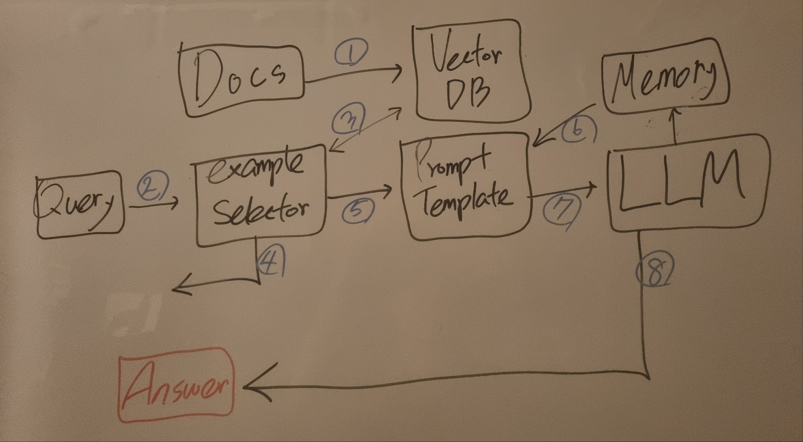

# FAQ Chatbot

## 1. RAG Architecture



1. Before receiving queries, embed docs and load to a vector db.
2. Get a query.
3. Check if the query is related to our domain using embedded docs.
4. If couldn't find related docs in the db, terminate.
5. Else, pass them to a prompt template.
6. If there are previous chats in a memory, use them.
7. Using the examples(query-related docs) and the previous chat, make a prompt and give it to LLM.
8. Generate an answer and save the query and the answer to the memory.

## 2. Setting

### 2.1. Environments

- Python 3.10.12
- RTX A6000-48G
- CUDA 12.0

### 2.2. Install libraries

```
pip install -r requirements.txst
```

## 3. Data ETL

```sh
python data/etl.py --pkl_path <pkl file path>
```

- After the cmd, json file and db file are saved on `./data`

## 4. Run

```
python run.py
```
